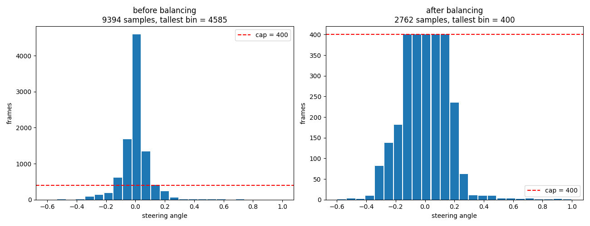

# Environment Setup

For our implementation, we used Python 3.8.

We created an environment using conda and the provided package requirements file:

```
conda create --name venv_CV-Project --file .\package_list.txt

conda activate venv_CV-Project
```

A number of the requirements had to be installed using pip instead of conda, as they were indicated in the package_list.txt:

```
pip install pandas==1.2.4 scikit-learn==0.24.2 scikit-image==0.18.3 imgaug==0.4.0 joblib==1.0.1 opencv-python matplotlib pillow

pip install flask==1.1.2 werkzeug==2.0.1 jinja2==3.0.1 itsdangerous==2.0.1 markupsafe==2.0.1 python-socketio==4.2.1 python-engineio==3.8.2.post1 flask-socketio==3.3.1 eventlet==0.25.1
```

# Project Structure

```
project/
  data_forward/            # forward-direction recording
    driving_log.csv
    IMG/
  data_reverse/            # reverse-direction recording
    driving_log.csv
    IMG/

  data_loader.py           # loading and balancing data
  preprocessing.py         # crop / YUV / blur / resize / normalise
  augmentation.py          # pan, zoom, brightness, flip, and rotate training data
  generator.py             # train/validation split and batch generator
  training.py              # model training loop

  TestSimulation.py        # provided testing code, left unmodified
  model.h5                 # trained model
```

The recording folders are excluded from version control since they are exceptionally large, and were shared by compressing and uploading them for developers to download.

Each module can be ran directly to verify its own stage:

| Command | Verifies |
|---|---|
| `python data_loader.py` | Steering histograms before and after balancing |
| `python preprocessing.py` | Crop bounds and output shape |
| `python augmentation.py` | Each transformation |
| `python generator.py` | Batch shapes, augmented vs clean batches, throughput |

# Data Collection

Data was collected using the provided simulator from Udacity. We manually drove around the track using mouse controls, and split the recording into 2 sessions: forward and reverse. This is because the track had a bias towards turns in one direction since it was a loop, so to balance that out, we needed to also drive the opposite way. The two sessions were recorded into two separate folders:

| Session | Frames | Left | Right |
|---|---|---|---|
| `data_forward` | 4,494 | 60.9% | 7.4% |
| `data_reverse` | 4,900 | 12.6% | 65.3% |
| Combined | 9,394 | 35.7% | 37.6% |

Combining the two datasets resulted in a mean turning angle of just 0.0006, effectively now symmetric. We were told to use mouse input since it allowed for a continuous range of inputs for turning, and it resulted in over 100 distinct steering values.

# Balancing

Even still, there was another bias that was present, which was driving in a straight line, with a driving angle of 0. Similar to the diabetes problem we examined in class, if we leave the data like this, a network which completely ignores the image and always outputs a steering angle of 0 would seemingly appear to be a success, despite being completely incorrect. To correct this, we divided out data into bins of steering ranges, and limited each bin to only 400 samples, randomly discarding down to 400 if they exceed it. This resulted in reducing the sample size of 9364 down to 2762, only 30% of the actual full data set.



# Pre-processing

During pre-processing, images are loaded from disk and converted from BGR to RGB, then processed. The pre-processing function operates as follows: The image is then cropped so that only the road area remains, removing unessential elements such as the sky. Then, the image is converted to the YUV color space and resized to 200x66 pixels, the same specs as used by the model. 

To verify that this pipeline works as expected, a sample size of 3 images is taken to display a 3x3 grid of images. The grid has three columns: a column of original images, a column of cropped road sections, and a column of processed images. The final check confirms that the array matches the expected input shape before training. 

# Augmentation

Augmentation is a way of improving the generalization of a model, by increasing the diversity in a data set without adding new data. For example, you can apply techniques such as flipping, brightness adjustment, zooming, etc. We don't need augmentation in validation because at that stage we are simply measuring the accuracy of the model, not training it further. As well, during validation we want to test the model on real world data, and artificially modifying the images defeats the purpose. 

# Model Architecture


The model architecture consists of five convolutional layers followed by three fully-connected dense layers. The first three convolutional layers use 5x5 kernels with a (2, 2) stride to downsample the image, followed by two unstrided convolutional layers with 3x3 kernels to capture higher-level spatial details. The resulting feature map is then flattened into 1,164 neurons that are passed through dense layers of 100,50, and 10 neurons, culminating in a final 1-neuron output for vehicle control.

[TODO] ADD TABLE OF LAYERS

# Training

The model was trained using the Mean Squared Error loss function and the Adam optimizer with a learning rate of 0.0001. Training was initially conducted over 15 epochs with 300 steps per epoch and a batch size of 100, but then changed to 50epochs with 100 steps per epoch to experiment. This nearly doubled the training time, despite the number of steps being nearly the same (4500 vs 5000). It did, however, result in a significantly better performance, allowing us to test the simulator at 30 MPH rather than 10. 

During training, the batches were streamed dynamically by the batch generator, applying augmentation on the data set before passing images through the preprocessing pipeline.  Conversely, the validation set was built using unaugmented preprocessed images to evaluate the model's performance in real world conditions.

The loss curve rapidly decreases in the first three epochs as the model learns basic spatial features such as road borders and lane positions. From epoch 4 onward, the training loss decreases at a more steady pace, eventually flattening out at an error of 0.0062. 

Validation loss remains lower than training loss consistently through the loss curve, with the biggest difference being in the first three epochs. This is likely due to the model having more trouble with the augmented images in the training data set than the unmodified images in the validation data set. 


# Running the Project

## Training

`training.py` loads both recording sessions via `dataloader.py` which balances the steering distribution, and then augments the training data via `augmentation.py`, before training and writing `model.h5` and `loss_curve.png`. Additionally, it also prints the final validation MSE alongside the MSE of a model that always outputs zero. If the model does not beat that baseline, it has not learned to use the image and the training has failed.

The adjustable constants at the top of the file are: `DATA_DIRS`, `SAMPLES_PER_BIN`, `BATCH_SIZE`, `STEPS_PER_EPOCH`, `EPOCHS`.

```
python.exe training.py
```

# Testing in the simulator

First, the testing script must be ran:

```
python TestSimulation.py
```

Then launch `beta_simulator.exe`, using the same graphics settings as data collection (640×480, Fastest, Windowed) and select Autonomous Mode.
The server listens on port 4567; the simulator prints `Connected` when the handshake succeeds.

The model predicts steering only and has no influence on speed, as the speed is set to 10 MPH in `testsimulation.py`.

# Results

A video of the first model driving can be found [uploaded to youtube](https://youtu.be/FiUycL_BJKs). It is able to complete the laps consistently, though it will occasionally be driving on the line or slightly over. When changing the max speed to 30MPH, it does have some difficulties staying on the road, driving off of it and having no training to recover it. The second model, however, does not have this same difficulty, and drives around the track with no issues at 30MPH. Despite the training data being the same, and the number of total steps not being very different, the resulting model performs significantly better. A video of the second model driving can be found [here](link). [TODO] RECORD VIDEO AND INSERT LINK

# Challenges

[TODO]

## Colour space conversion

`TestSimulation.py` receives camera frames through PIL, which produces images in RGB, and then converts them with `cv2.COLOR_RGB2YUV`. However, `cv2.imread` produces images in BGR order.

What makes this annoying is that nothing fails. There is no error, no warning, and no anomaly in the metrics: training completes normally and loss decreases normally, the numbers look entirely reasonable. The only symptom is a car that drives as though it were guessing, which is easy to misattribute to insufficient training or bad data.

We addressed this by converting BGR to RGB immediately after reading each image, inside `load_image()` in `preprocessing.py`, so that both the training and inference paths perform an identical sequence of colour conversions.

## Training time

Initially, when we attempted to train the model, it appeared to stall at the very first epoch before any steps were made. We left it running for 20 minutes in case it was just a matter of time, but no progress was made. We though that this had to do with inefficiencies in our code, or oversampling of the training set, and made changes to try to address these problems, even reducing the steps per epoch to see if it would run at all; but unfortunately, none of these made any difference.

By doing some testing, we found that the forward convolution was fine, but the gradient computation never completd. Doing some research into why, we found that this mean the convolution backpropagation was the problem, and it had to do with the Intel MKL backend.

The solution involved adding environment variables prior to importing TensorFlow in `training.py`:

```python
os.environ['TF_DISABLE_MKL'] = '1'
os.environ['OMP_NUM_THREADS'] = '8'
os.environ['KMP_BLOCKTIME'] = '0'
```

These environment variables also needed to be added to the `TestSimulation.py` for consistency.

`TF_DISABLE_MKL` instructs TensorFlow to use its fallback kernels instead of MKL's. `OMP_NUM_THREADS` caps the OpenMP thread pool to avoid oversubscription on a 16-core machine, and `KMP_BLOCKTIME` stops idle threads from spinning for 200 ms before sleeping. These three combined appeared to fix the problem, as the training was able to complete, with a training time per epoch of around 50 seconds. 
